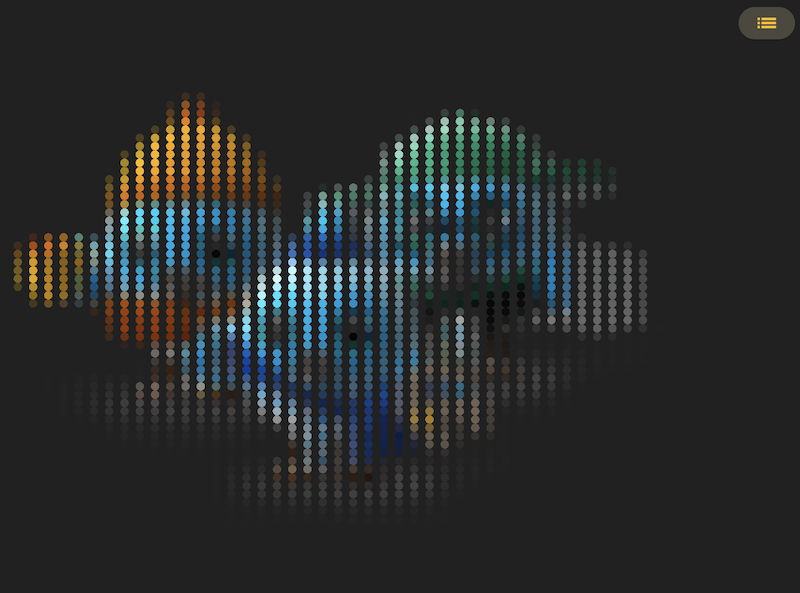
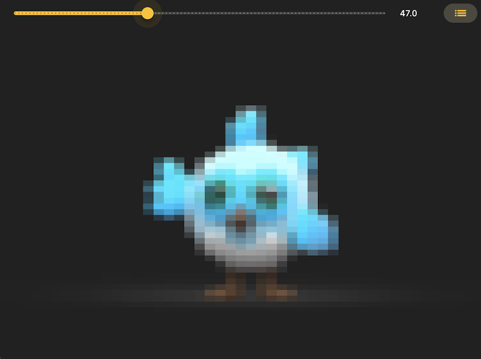

# Flutter shader lab

examples of simple Flutter shaders

⚠️ you need to upgrade to Flutter 3.17+ or be on Flutter master channel ( or maybe beta IDK... ) and run on mobile or desktop

- uses [flutter_shaders](https://github.com/jonahwilliams/flutter_shaders)
- intro to shaders : https://thebookofshaders.com
- others flutter shaders examples :
  - https://github.com/wolfenrain/flutter_shaders_example
  - https://github.com/renancaraujo/shaders_playground
  

